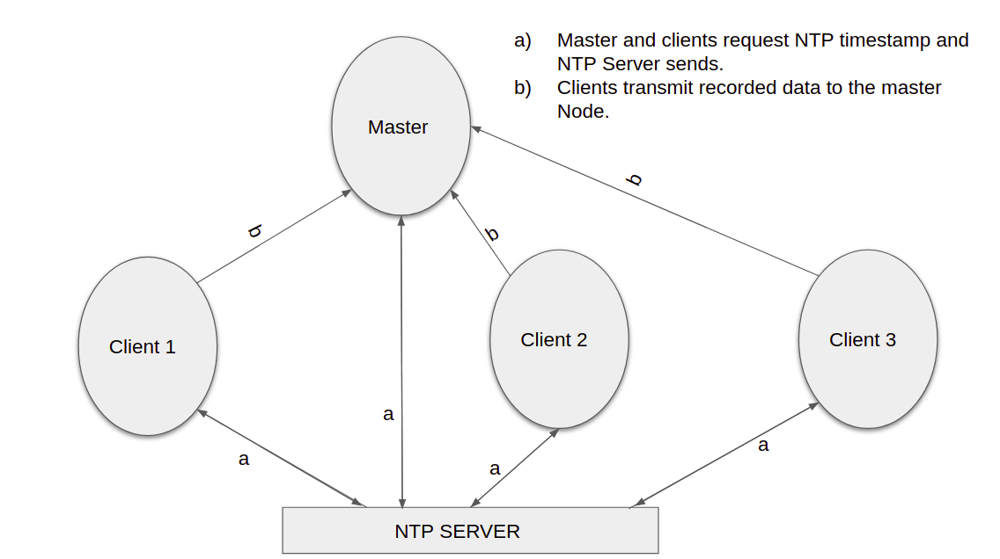

# Synchronization-of-Sensor-Nodes-in-a-Wireless-Network
This repo explains the time synchronization problem in wireless sensor networks and details the basic algorithms proposed in this area.
Wireless Sensor Networks (WSN) consist of a number of low-cost, miniature and
lightweight sensor nodes like ESP32 devices that can communicate to each other
over a wireless radio standard. For recording vital parameters most prominent
characteristic of a wireless sensor network is the time synchronization, due to the
physical separation between all the sensor nodes and each node has its own clock.
The system setup consists of three or more wireless sensor nodes with an imple-
mented time synchronisation protocol, which aims at equalizing the local times for
all nodes in the network. After synchronization,evaluation is performed where the
three nodes gets simultaneously an interrupt by a fourth node to send their times-
tamp, which can be analysed later by comparing the timestamp of all nodes to
master timestamp.
Conclusion in this case, without any time synchronization, the time offset mounts to
more than 5 ms after 10 minutes when implemented with multiple wireless network
devices. However, if all devices have the same clock frequency, which means no
clock drift between devices, the period for which all nodes are within +/- 5 ms
can be increased. When we choose the proper frequency of synchronization and
all the devices in the network have identical clock frequencies or minimum clock
drift between them, the implemented and evaluated Time Synchronization Protocol
works in an optimal solution and the offset is always less than 5 ms with a possible
error of less than 5%. Furthermore, we can conclude that aging of the ESP32 device
can reduce clock speed.

# python files
for monitoring serial port of Master and saving the latencies into CSV files.
Other file to plot the recorded data.

# methods for synchronizations
1) NTP synchronization

2) clients synchronize with master and master to NTP server
Master gets timestamp from NTP server & client get timstamp from master node.png)

3) setup to calculate the drift periodically

# Implementation
Refer implementation section of the report file.
